# JPay ER Diagram

This document contains the Entity-Relationship diagram for the JPay system.

```mermaid
erDiagram
	direction TB
	TENANT_TYPE {
		uuid id PK ""  
		text code UK "Internal type code, e.g. BUILDING, SCHOOL, UTIL_WATER"  
		text name  "Human readable type name"  
		jsonb tenant_fields_schema_json  "Schema/metadata for extra tenant fields (dynamic UI)"  
		jsonb customer_fields_schema_json  "Schema/metadata for extra customer fields (dynamic UI)"  
		timestamptz created_at  ""  
		timestamptz updated_at  ""  
	}

	TENANT {
		uuid id PK ""  
		text external_org_id UK "External Organization ID"  
		text name  "Tenant display name"  
		text contact_email  "Main contact email"  
		text contact_phone  "Main contact phone"  
		uuid tenant_type_id FK "FK to TENANT_TYPE"  
		jsonb customer_field_overrides_json  "Tenant-specific editable copy of customer field definitions"  
		timestamptz created_at  ""  
		timestamptz updated_at  ""  
	}

	TENANT_USER {
		uuid id PK ""  
		uuid tenant_id FK "Tenant this user belongs to"  
		text external_user_id UK "External User ID"  
		text username  "Username/display handle"  
		text firstname  "Firstname"
		text lastname  "Lastname"
		text status  "Status PENDING_INVITE | ACTIVE"
		timestamptz created_at  ""  
		timestamptz updated_at  ""  
	}

	ROLE {
		uuid id PK ""  
		text external_role_key  "UK Maps to External role identifier/key"  
		text name  "Role name shown in app"  
		boolean only_admin  "" 
		timestamptz created_at  ""  
		timestamptz updated_at  ""  
	}

	PERMISSION {
		uuid id PK ""   
		text code UK "Unique permission code"  
		text permission_type  "MENU | ACTION | ... (extensible)"  
		text group  "Optional menu grouper: overview | management | reports"  
		uuid parent_permission_id FK "Self-FK for menu tree (null = root)"  
		int sort_order  "Order among siblings (menus)"  
		boolean is_active  ""  
		boolean only_admin  "" 
		timestamptz created_at  ""  
		timestamptz updated_at  ""  
	}

	PERMISSION_TRANSLATION {
		uuid id PK ""  
		uuid permission_id FK "FK to PERMISSION"  
		text language_code  "ISO language code: en, es, pt, ..."  
		text label  "Menu label / permission label"  
		text description  "Optional longer description"  
		timestamptz created_at  ""  
	}

	ROLE_PERMISSION {
		uuid role_id FK "FK to ROLE"  
		uuid permission_id FK "FK to PERMISSION"  
		timestamptz created_at  ""  
	}

	CUSTOMER {
		uuid id PK ""  
		uuid tenant_id FK "Tenant scope"  
		text first_name  ""  
		text last_name  ""  
		text email  ""  
		text phone  ""  
		date date_of_birth  ""  
		text national_id_number  "ID document number"  
		timestamptz created_at  ""  
		timestamptz updated_at  ""  
	}

	CUSTOMER_CUSTOM_FIELD {
		uuid id PK ""  
		uuid customer_id FK "FK to CUSTOMER"  
		text field_key  "Key/name of custom field"  
		text field_value  "Stored value (string). Use jsonb if you need typed values"  
		timestamptz created_at  ""  
		timestamptz updated_at  ""  
	}

	TENANT_CUSTOM_FIELD {
		uuid id PK ""  
		uuid tenant_id FK "FK to TENANT"  
		text field_key  "Key/name of custom field"  
		text field_value  "Stored value (string). Use jsonb if you need typed values"  
		timestamptz created_at  ""  
		timestamptz updated_at  ""  
	}

	PAYMENT_TYPE {
		uuid id PK ""  
		uuid tenant_id FK "Tenant scope"  
		text logical_code  "Same across languages: QR, CASH, CARD, TRANSFER..."  
		text language_code  "ISO language code: en, es, ..."  
		text display_name  "Localized name shown to users"  
		text description  "Localized description/help text"  
		jsonb status_flow_json  "Ordered allowed statuses, e.g. ['CREATED','PENDING','PAID']"  
		text expiration_status_code  "Status to set when expired, e.g. EXPIRED"  
		text failure_status_code  "Status to set when failed, e.g. FAILED"  
		boolean is_active  ""  
		timestamptz created_at  ""  
		timestamptz updated_at  ""  
	}

	TENANT_PAYMENT_TYPE {
		uuid tenant_id FK "FK to TENANT"  
		uuid payment_type_id FK "FK to PAYMENT_TYPE"  
		timestamptz created_at  ""  
	}

	PAYMENT {
		uuid id PK ""  
		uuid tenant_id FK "Tenant scope"  
		uuid created_by_user_id FK "Who generated the payment"  
		uuid customer_id FK "Optional: link payment to a customer (nullable)"  
		uuid payment_type_id FK "FK to PAYMENT_TYPE"  
		numeric amount  "Total payment amount"  
		text currency_code  "ISO currency: BOB, USD..."  
		text status_code  "Current payment status (must be in PAYMENT_TYPE.status_flow_json)"  
		timestamptz expires_at  "Optional: when this payment request expires"  
		timestamptz paid_at  "When payment completed"  
		timestamptz created_at  ""  
		timestamptz updated_at  ""  
		jsonb metadata_json  "Gateway refs, QR data, bank refs, notes..."  
	}

	BILLING_CYCLE {
		uuid id PK ""  
		uuid tenant_id FK "Tenant scope"  
		int billing_year  "e.g. 2026"  
		int billing_month  "1-12"  
		text status_code  "DRAFT | PUBLISHED | CLOSED"  
		timestamptz published_at  "When cycle was published (ready to collect)"  
		uuid published_by_user_id FK "User who published"  
		timestamptz closed_at  "When cycle was closed"  
		uuid closed_by_user_id FK "User who closed"  
		timestamptz created_at  ""  
		timestamptz updated_at  ""  
	}

	CHARGE_CONCEPT {
		uuid id PK ""  
		uuid tenant_id FK "Tenant scope"  
		text logical_code  "Same across languages: HOA_FEE, WATER, TUITION, LATE_FEE, PREPAY_DISCOUNT..."  
		text language_code  "ISO language code: en, es..."  
		text display_name  "Localized label"  
		text description  "Localized explanation"  
		text concept_type  "CHARGE | DISCOUNT | PENALTY | ADJUSTMENT"  
		boolean is_active  ""  
		timestamptz created_at  ""  
		timestamptz updated_at  ""  
	}

	INVOICE {
		uuid id PK ""  
		uuid tenant_id FK "Tenant scope"  
		uuid customer_id FK "FK to CUSTOMER"  
		uuid billing_cycle_id FK "FK to BILLING_CYCLE (one invoice per month per customer)"  
		text status_code  "DRAFT | OPEN | PARTIALLY_PAID | PAID | VOID"  
		date due_date  "Due date for this invoice"  
		numeric subtotal_amount  "Sum of CHARGE items"  
		numeric discount_amount  "Sum of DISCOUNT items (positive number stored separately or computed)"  
		numeric penalty_amount  "Sum of PENALTY items"  
		numeric total_amount  "Final total to be paid"  
		numeric paid_amount  "Total amount applied via INVOICE_PAYMENT"  
		timestamptz issued_at  "When invoice became collectible (often at publish)"  
		timestamptz created_at  ""  
		timestamptz updated_at  ""  
	}

	INVOICE_ITEM {
		uuid id PK ""  
		uuid invoice_id FK "FK to INVOICE"  
		uuid charge_concept_id FK "FK to CHARGE_CONCEPT"  
		text description  "Free text description for this line"  
		numeric quantity  "Default 1 for most fees"  
		numeric unit_price  "Unit price (for quantity-based items)"  
		numeric amount  "Signed amount: CHARGE(+), DISCOUNT(-), PENALTY(+)"  
		jsonb metadata_json  "E.g. meter reading, prepay info, late-fee calc details"  
		timestamptz created_at  ""  
		timestamptz updated_at  ""  
	}

	INVOICE_PAYMENT {
		uuid id PK ""  
		uuid invoice_id FK "FK to INVOICE"  
		uuid payment_id FK "FK to PAYMENT"  
		numeric applied_amount  "How much of PAYMENT.amount was applied to this invoice"  
		timestamptz created_at  ""  
	}

	LATE_FEE_POLICY {
		uuid id PK ""  
		uuid tenant_id FK "Tenant scope"  
		text code  "Policy code, e.g. LATE_DEFAULT"  
		text calculation_type  "FIXED_AMOUNT | PERCENT_OF_BALANCE"  
		numeric fixed_amount  "Used when calculation_type=FIXED_AMOUNT"  
		numeric percent_rate  "Used when calculation_type=PERCENT_OF_BALANCE (e.g. 0.05 = 5%)"  
		int grace_days  "Days after due_date before late fee applies"  
		text apply_scope  "INVOICE | INVOICE_ITEM (recommended: INVOICE_ITEM)"  
		text compounding_period  "NONE | DAILY | MONTHLY (optional)"  
		numeric max_fee_amount  "Cap for late fees (optional)"  
		boolean is_active  ""  
		timestamptz created_at  ""  
		timestamptz updated_at  ""  
	}

	LATE_FEE_POLICY_CONCEPT {
		uuid late_fee_policy_id FK "FK to LATE_FEE_POLICY"  
		uuid charge_concept_id FK "Which concepts can generate late fees"  
		boolean is_enabled  "true=policy applies to this concept"  
		timestamptz created_at  ""  
	}

	PREPAYMENT_DISCOUNT_POLICY {
		uuid id PK ""  
		uuid tenant_id FK "Tenant scope"  
		text code  "Policy code, e.g. PREPAY_ANNUAL"  
		text discount_basis  "CONCEPT_ONLY (recommended) | INVOICE_TOTAL"  
		boolean is_active  ""  
		timestamptz created_at  ""  
		timestamptz updated_at  ""  
	}

	PREPAYMENT_DISCOUNT_TIER {
		uuid id PK ""  
		uuid prepayment_discount_policy_id FK "FK to PREPAYMENT_DISCOUNT_POLICY"  
		int min_months_prepaid  "e.g. 12"  
		int max_months_prepaid  "nullable = no upper bound"  
		text discount_type  "PERCENT | FIXED_AMOUNT"  
		numeric percent_rate  "If discount_type=PERCENT"  
		numeric fixed_amount  "If discount_type=FIXED_AMOUNT"  
		boolean is_active  ""  
		timestamptz created_at  ""  
	}

	PREPAYMENT_DISCOUNT_POLICY_CONCEPT {
		uuid prepayment_discount_policy_id FK "FK to PREPAYMENT_DISCOUNT_POLICY"  
		uuid charge_concept_id FK "Eligible concepts for prepay discount (e.g. HOA_FEE only)"  
		boolean is_enabled  ""  
		timestamptz created_at  ""  
	}

	TENANT_TYPE||--o{TENANT:"defines"
	TENANT||--o{TENANT_USER:"has"
	PERMISSION||--o{PERMISSION_TRANSLATION:"translated_as"
	ROLE||--o{ROLE_PERMISSION:"maps"
	PERMISSION||--o{ROLE_PERMISSION:"maps"
	PERMISSION||--o{PERMISSION:"parent_of"
	TENANT||--o{CUSTOMER:"has"
	CUSTOMER||--o{CUSTOMER_CUSTOM_FIELD:"has"
	TENANT||--o{TENANT_CUSTOM_FIELD:"has"
	TENANT||--o{PAYMENT_TYPE:"defines"
	TENANT||--o{TENANT_PAYMENT_TYPE:"allows"
	PAYMENT_TYPE||--o{TENANT_PAYMENT_TYPE:"is_allowed"
	TENANT||--o{PAYMENT:"receives"
	TENANT_USER||--o{PAYMENT:"created_by"
	CUSTOMER||--o{PAYMENT:"optional_for"
	PAYMENT_TYPE||--o{PAYMENT:"categorizes"
	TENANT||--o{BILLING_CYCLE:"has"
	TENANT_USER||--o{BILLING_CYCLE:"publishes_closes"
	BILLING_CYCLE||--o{INVOICE:"contains"
	TENANT||--o{INVOICE:"issues"
	CUSTOMER||--o{INVOICE:"billed"
	INVOICE||--o{INVOICE_ITEM:"has"
	CHARGE_CONCEPT||--o{INVOICE_ITEM:"categorizes"
	INVOICE||--o{INVOICE_PAYMENT:"receives"
	PAYMENT||--o{INVOICE_PAYMENT:"applies_to"
	TENANT||--o{CHARGE_CONCEPT:"defines"
	TENANT||--o{LATE_FEE_POLICY:"defines"
	LATE_FEE_POLICY||--o{LATE_FEE_POLICY_CONCEPT:"scopes"
	CHARGE_CONCEPT||--o{LATE_FEE_POLICY_CONCEPT:"eligible_for_late_fee"
	TENANT||--o{PREPAYMENT_DISCOUNT_POLICY:"defines"
	PREPAYMENT_DISCOUNT_POLICY||--o{PREPAYMENT_DISCOUNT_TIER:"has"
	PREPAYMENT_DISCOUNT_POLICY||--o{PREPAYMENT_DISCOUNT_POLICY_CONCEPT:"scopes"
	CHARGE_CONCEPT||--o{PREPAYMENT_DISCOUNT_POLICY_CONCEPT:"eligible_for_prepay_discount"
```

## Examples: Prepay Discount + Late Fee

### Example Concepts for a Building Tenant (EN)

- **HOA_FEE**: `concept_type=CHARGE`
- **WATER**: `concept_type=CHARGE`
- **PREPAY_DISCOUNT**: `concept_type=DISCOUNT` (negative invoice_item.amount)
- **LATE_FEE**: `concept_type=PENALTY` (positive invoice_item.amount)

### Example Prepayment Rule

- **PREPAYMENT_DISCOUNT_POLICY**: `code=PREPAY_ANNUAL`, `discount_basis=CONCEPT_ONLY`
- **PREPAYMENT_DISCOUNT_TIER**: `min_months_prepaid=12`, `discount_type=PERCENT`, `percent_rate=0.10`
- **PREPAYMENT_DISCOUNT_POLICY_CONCEPT**: HOA_FEE `enabled=true` (WATER not linked, so no discount)

### Example Invoice Items (January)

- HOA_FEE: `amount=+100`
- WATER: `amount=+30`
- PREPAY_DISCOUNT: `amount=-10` `metadata_json={"applies_to_concept":"HOA_FEE","months_prepaid":12,"percent":10}`

### Example Late Fee

- **LATE_FEE_POLICY**: `calculation_type=PERCENT_OF_BALANCE`, `percent_rate=0.05`, `grace_days=5`, `apply_scope=INVOICE_ITEM`
- **LATE_FEE_POLICY_CONCEPT**: HOA_FEE `enabled=true` (so late fee is computed for HOA_FEE only if desired)